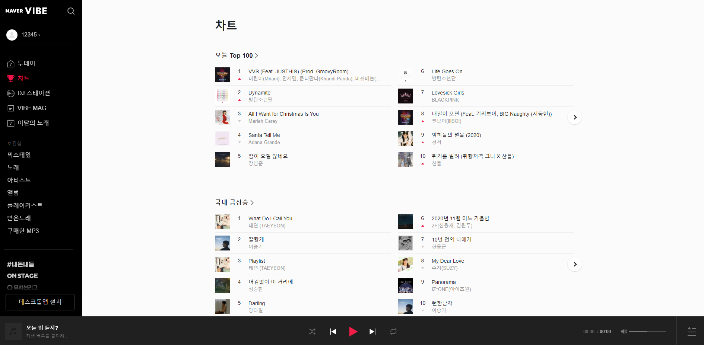
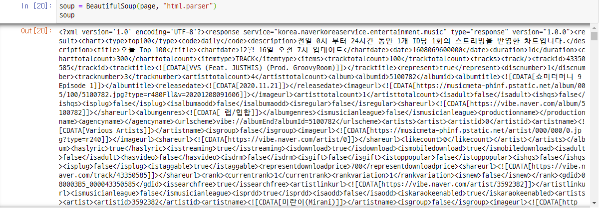
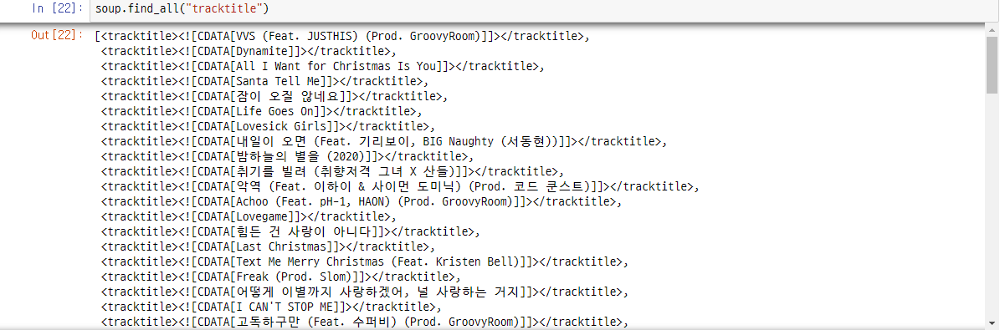
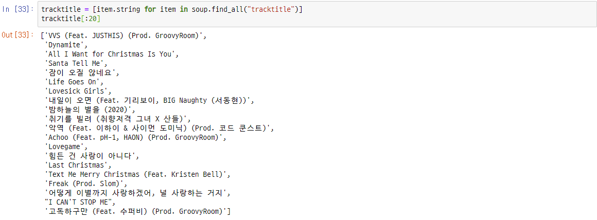
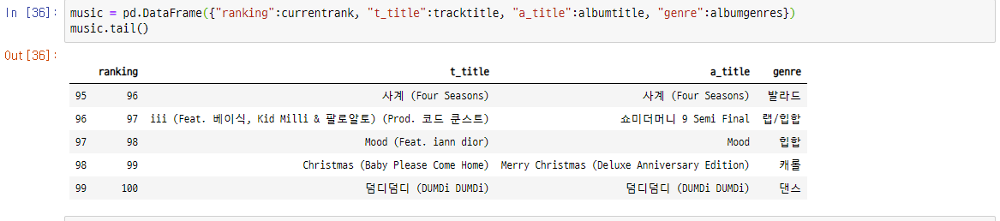

# naver vibe data crawling
- 네이버 음악 서비스인 vibe 의 오늘 Top 100 차트의 데이터 크롤링




## 1. page information
- Request URL: https://apis.naver.com/vibeWeb/musicapiweb/vibe/v1/chart/track/total
- Requests Method : GET
- type : 동적페이지

## 2. parsing
- xml 형태의 데이터를 json 형태로 변환시켜주는 xmltodict 패키지를 사용
```
import requests
import json
import xmltodict
```
### 1) url settings
```
start, display = 1, 300
url = "https://apis.naver.com/vibeWeb/musicapiweb/vibe/v1/chart/track/total?start={}&display={}".format(start, display)
print(url)
```
- https://apis.naver.com/vibeWeb/musicapiweb/vibe/v1/chart/track/total?start=1&display=300

### 2) requests
- xml 형태의 정렬이 안된 데이터가 출력된다.
- 필요한 데이터를 가져오기 위해 엘리먼트를 찾아야한다.
```
response = requests.get(url)
response

=====<print>=====

<Response [200]>
```

- 데이터 확인
```
response.text
```


### 3) xml -> json
- xmltodict 패키지의 기능을 사용하면 xml 형태의 데이터를 json 형태로 바꿔준다.
```
datas = json.dumps(xmltodict.parse(response.text))
datas = json.loads(datas)
```


### 3) data search
- 가수명, 앨범명, 랭킹순위 등 필요한 데이터가 dict 의 6 개 하위에 들어있다.
```
basic_cate = datas["response"]["result"]["chart"]["items"]["tracks"]["track"][1]
```


```
### 4) data parsing
- 기본 카테고리를 사용하여, 랭킹, 아티스트명, 노래명, 앨범명, 앨범장르 데이터를 파싱
- 아티스트명은 여러 아티스트가 함께 작업한 경우 dict 의 구조가 달라서 예외처리를 사용해야했다.
```
dfs = []
basic_cate = datas["response"]["result"]["chart"]["items"]["tracks"]["track"]

for i in range(len(basic_cate)) :
    
    ranking = basic_cate[i]["rank"]["currentRank"]
    
    try : 
        artistName = basic_cate[i]["artists"]["artist"]["artistName"]
    except :
        #artistName = datas["response"]["result"]["chart"]["items"]["tracks"]["track"][i]["album"]["artists"]["artist"]["artistName"]
        artistName = "Various Artist"
    
    trackTitle = basic_cate[i]["trackTitle"] 
    albumTitle = basic_cate[i]["album"]["albumTitle"]
    albumGenres = basic_cate[i]["album"]["albumGenres"]
    
    dfs.append({
        "ranking" : ranking,
        "artistName" : artistName,
        "trackTitle" : trackTitle,
        "albumTitle" : albumTitle,
        "albumGenres" : albumGenres,
    })
```

- 데이터 프레임으로 전환
- 1위 부터 300위 까지의 데이터가 잘 저장됐다.
```
top_list = pd.DataFrame(dfs)
```


## 3. BeautifulSoup 을 사용하여 크롤링
- xmltodict 를 사용하여 xml 을 json 으로 바꿔서 사용하니 dict 가 길어지는 불편함이 있었다.
- 좀 더 간단한 방법으로 가져오기 위해 BeautifulSoup 을 이용 find_all 기능을 사용해 보았다.

```
import requests
from bs4 import BeautifulSoup
from urllib.request import urlopen
```
```
start, display = 1, 100
url = "https://apis.naver.com/vibeWeb/musicapiweb/vibe/v1/chart/track/total?start={}&display={}".format(start, display)
page = urlopen(url)

soup = BeautifulSoup(page, "html.parser")
```

- 데이터를 잘 가져왔다. 서치하기 어려운 형태이다.



- find_all을 사용하여 특정 엘리먼트를 검색하니, 해당되는 데이터만 골라서 잘 나왔다.
```
soup.find_all("tracktitle")
```



- 필요한 부분만 떼어내기 위해 .string 을 함께 사용, 리스트컴프리핸션으로 list 데이터로 변환.
```
tracktitle = [item.string for item in soup.find_all("tracktitle")]
tracktitle[:20]
```



- 필요한 데이터에 일괄적용하고 데이터프레임으로 전환
```
tracktitle = []
albumtitle = []
albumgenres = []
currentrank = []

for i in range(len(soup.find_all("track"))) :
    tracktitle = [each.string for each in soup.find_all("tracktitle")]
    albumtitle = [each.string for each in soup.find_all("albumtitle")]
    albumgenres = [each.string for each in soup.find_all("albumgenres")]
    currentrank = [each.string for each in soup.find_all("currentrank")]

music = pd.DataFrame({"ranking":currentrank, "t_title":tracktitle, "a_title":albumtitle, "genre":albumgenres})
music.tail()
```


## 4. summary
- 동적페이지의 경우 전체데이터를 가져오기 어렵다.
- 따라서 requests 를 사용하거나 bs4 를 사용하여 xml 형태로 가져온 뒤, 
     - xmltodict 를 사용하여 json 으로 변환 후 key-value 값을 사용하거나,
     - find_all 을 사용하여 필요한 항목을 검색해서 사용하면 좋을 것 같다.
